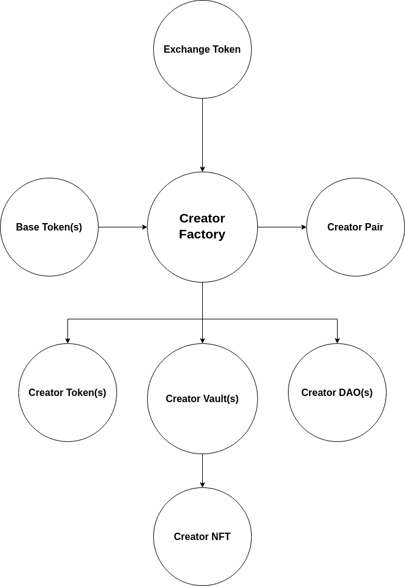

# [Xeldorado Protocol](https://main.xeldorado.live/)
### Xeldorado - A general purpose Creator Social Token (CST) Protocol that implements Creator Economy using:
#### 1. Growth Tokens
  Creator/Community Social Tokens that offer potential increase in price as Creator/Community grows. Growth Tokens are superior version of Loyalty Tokens. They are traded with in-house AMM and offers:
   - <b>Liquidity Pair of CreatorToken-BaseToken</b> : Gateway between Creator Economy and External World. Creator can choose from a list of options to select best suited BaseToken. For e.g. USDC, DAI, WETH, WBTC, BUSD, etc. 

   - <b>NFTs that are pegged to CreatorToken</b> : Price of 1 NFT will be constant w.r.t. CreatorToken and every time a new NFT is added to the vault same number of CreatorTokens will be minted to ensure the peg. Price of NFT soars when Creator Tokens soars w.r.t. Base Tokens. Secondary Market for NFT allows price to soar further but the ceiling price of NFTs stay constant w.r.t. Creator Tokens.

   - <b>Bank</b> : for NFT backed lending borrowing of Creator Tokens

   - <b>DAO</b> : for Creator community governance. Handles community treasury.
  
#### 2. Loyalty Tokens
  Creator tokens that are sold to offer access to premium stuff from creator. It could be exclusive video content, one-on-one, merchandise, or in real world like access to front row seats of Creator's show (if creator is a musician or comedian). It is limited only to creator's imagination. 
   - <b>Creator Tokens</b> : fans and followers can buy creator tokens at price fixed by creator or community. These tokens should be treated as vouchers or tickets which can be bought but one cannot sell them back directly. A creator can choose to create subscription by deducting some tokens from holder on regular basis.

   - <b>NFT Sale against Creator Token</b> : Creator or community can decide upon price of NFT in creator tokens and list it for sale. 

   - <b>DAO</b> : for Creator community governance. Handles community treasury.

Creator/Community can decide to opt for anyone of them.

## Features 

### 1. Growth Tokens
- [x] <b>Creator Vault</b>
  - [x] Creator Add/Mint NFTs to vault contract
  - [x] Launch Creator Token, make it available for community to buy. Liquidity is bought not rented. Since CreatorTokens offer NFT, DAO, Banking related utilities they do have value since day one of launch especially to access Vault NFTs.
  - [x] Price of NFTs is pegged to certain number of tokens at the time of launch and stays same forever so scope of rise in NFT prise is only from rise in token price of CreatorToken
  - [x] Same number of tokens are minted every time an NFT is added to vault, these tokens are transferred to DAO contract and can be used for Airdrop, FLO, Grants for community [batch supported]
  - [x] Holder of CreatorTokens can redeem NFT and tokens worth NFT price will be burnt from his wallet [batch supported]
  - [x] Holder of CreatorTokens can return his redeemed NFT and tokens worth NFT price will be minted to his wallet [batch supported]
  - [x] 2 NFTs of a creator can be swapped for no fees [batch supported]
  - [x] Creator/Community can add Further Liquidity to Pair Contract by sale of CreatorTokens from DAO contract. Vault Contract hosts this sale.
  - [x] Vault can own millions of NFTs. There are no arrays storing Vault's NFT data about redeemed NFTs. Instead a simple mapping of vaultId to NFT Contract and vaultId to TokenId is used and to know whether an NFT is redeemed a simple ownerOf() function call for a given vaultId will help determine. This is done to avoid For Loops over large arrays which will run out of gas after few thousand NFTs. Hence avoiding scaling bottleneck.

- [x] <b>Creator Pair</b>
  - [x] Constant Product based AMM for CreatorToken - BaseToken pair
  - [x] Swap between tokens

- [x] <b>Creator Vesting Vault</b>
  - [x] Tokens allocated to creator at the start are vested over a period of time, 2 years by default with 3 months of cliff period during which the vested token count will be increasing just that creator cannot redeem them due to cliff.

- [x] <b>Creator DAO</b>
  - [x] Token holders can make proposals 
  - [x] Creator can choose managers and those managers will be given allowances. Using these allowances they can pay folks/employees, they hire, for specific task either on Pay Per Task basis or monthly salaries. Managers can transfer from their allowances to the employee's allowance value. 
  - [x] 4 types of proposals 
    - [x] Airdrops, before CreatorToken launch as it is, after launch with voting and approval 
    - [x] Further LIquidity Offering (FLO) proposals to increase size of market to ensure greater liquidity in Pair contract
    - [x] Allowances Proposals to decide amount allocated per manager. Single proposal can handle multiple managers' allowances.
    - [x] General Proposal will contain link to their DAO Forum's proposal page where detailed discussions can take place. Results of these proposals will be acted upon by community members in good faith.
  - [x] Token holders can vote for each of the proposal
  - [x] Result of voting is based on number of CreatorTokens held by the voter. For first 3 cases only 2 choices, no or yes. For General Proposal any number of choices are allowed. 

- [x] <b>Migration to V2</b> 
  - [x] Pair, DAO, Vault and Bank contracts contains Token and NFT assets which is transfered via Migration Contract to V2 version of Pair, DAO, Vault and Bank contracts
  - [x] Before migration of a Creator Community's assets, community members must vote for or against mirgration and migration contract will be made public much in advance. Voting is implemented in CreatorToken contract. This is done to ensure security of assets and decentralisation of decision making. This is important since in Xeldorado Protocol liquidity isn't rented its owned.
  - [x] If voted no, then assets will stay in V1, current version, of Xeldorado Protocol
  - [x] There can be 2 types of migration, partial and complete. In partial migration only one or two parts maybe updated like only Vault contract updated and hence needs asset transfer only for Vault's V2 version. In full migration all 4 contracts will be updated and maybe entire Factory and CreatorFactory may also be updated. 
  - [x] Migration function in Pair, DAO, Vault and Bank are implemented with check on voting status passed and only after that migration contract, that has been voted, is allowed to transfer asset by deploying V2 version of the contract.
  - [x] Migration function also updates all dependent contracts with new address of V2 contract. For e.g. if Vault contract gets migrated to V2,then its dependent contract CreatorToken, CreatorNFT, CreatorDAO and CreatorFactory will get updated with V2 address of vault variable.

- [ ] <b>Creator Bank (Not needed on day one, can be integrated after launch)</b>
  - [ ] Bank contract needs price data from CreatorToken to decide upon interest rates. Hence, Each creator can have different interest rates
  - [ ] Community members, holders of CreatorToken can stake their CreatorTokens for some yield
  - [ ] NFT Loans: Holder of NFTs from Creator Vault can use it as collateral for borrowing CreatorTokens, since we have price data of CreatorTokens and also price of single NFT is fixed w.r.t. to CreatorToken we can estimate realistic valuation of NFTs
  - [ ] Flash Loans on Creator Tokens 

- [ ] <b>External Contract Functions</b>
  - [ ] 2 NFTs of different creator with same BaseTokens can be swapped with small fees 
  - [ ] If someone owns an NFT, you can buy it for premium by placing a bid (Auction smart contract will be placed separately) 
  - [ ] Base Token Pairs: Use a Curve kind of multi token pairs for BaseTokens for swap. This will help NFTs of creator that don't have same base token. Liquidity will be added by us using a small fraction of profit being earnt in BaseTokens. Swap in these pools will have no fees. 
<hr/>

### 1. Loyalty Tokens
- [x] <b>Creator Token</b>
  - [x] Buy Tokens at a price fixed by Creator/Community. The Base Token received are send to DAO contract which handles treasury.

- [x] <b>Creator DAO</b>
  - [x] Token holders can make proposals 
  - [x] Creator/Community can airdrop Creator Tokens to any account since these tokens cannot be sold and only be used to access premium stuff no need risks of price drop involded.
  - [x] Creator/Community can add managers and those managers will be given allowances in Base Tokens. Using these allowances they can pay folks/employees, they hire, for specific task either on Pay Per Task basis or monthly salaries. Managers can transfer from their allowances to the employee's allowance value. 
  - [x] 2 types of proposals 
    - [x] Allowances Proposals to decide amount allocated per manager. Single proposal can handle multiple managers' allowances.
    - [x] General Proposal will contain link to their DAO Forum's proposal page where detailed discussions can take place. Results of these proposals will be acted upon by community members in good faith.
  - [x] Token holders can vote for each of the proposal
  - [x] Result of voting is based on number of CreatorTokens held by the voter. For first case only 2 choices, no or yes. For General Proposal any number of choices are allowed. 
  
- [x] <b>Creator Vault</b>
  - [x] Creator/Community can add NFTs to vault. Further list it for Sale at before mentioned price.
  - [x] NFTs are sold for Creator Tokens which can be burnt since they are only a form of voucher/tickets.

## Smart Contracts Flow Diagram

#### 1. Growth Tokens

<hr/>

#### 2. Loyalty Tokens


## Network Expansion Plans

We plan to fist expand to all the networks that are EVM compatible and have significantly low gas fees:

1. Polygon
2. BSC 
3. Avalanche 
4. Fantom 
5. Arbitrum 
6. Optimism 
7. MoonRiver 
8. xDai 
9. Harmony 
10. Polkadot
11. Solana (Using Solang Compiler or maybe Neon)
   
We further plan to expand to EVM non-compatible networks depending on user demand:

1. Solana 
2. Algorand 
3. Cardano 
4. Terra 


## Documentation

<!-- Visual Explanations for protocol: [Understand](https://main.xeldorado.live/index.html#xeldoradoprotocol) -->

<!-- <a href="https://main.xeldorado.live/index.html#xeldoradoprotocol" target="_blank"></a> -->

White paper & Docs for Xeldorado Protocol is currently under development.

## Tests

For tests please refer to [`README`](./test/README.md) from test folder.

## Licensing

The primary license for Xeldorado Contracts V1 is the Business Source License 1.1 (`BUSL-1.1`), see [`LICENSE`](./LICENSE). 

<h3>
    
```diff
!!! Overall this repository is not available for production use !!!
```

</h3>

### Exceptions

- All files in `contracts/interfaces/` are licensed under `GPL-2.0-or-later` (as indicated in their SPDX headers), see [`contracts/interfaces/LICENSE`](./contracts/interfaces/LICENSE)
- Several files in `contracts/libraries/` are licensed under `GPL-2.0-or-later` (as indicated in their SPDX headers), see [`contracts/libraries/LICENSE`](contracts/libraries/LICENSE)
- All files in `contracts/test` remain unlicensed.

## Community

<a href="https://discord.gg/ExMb82zpnB" target="_blank"></a>&emsp;&emsp;&emsp;
<a href="https://t.me/xeldorado" target="_blank"></a>&emsp;&emsp;&emsp;
<a href="https://twitter.com/XeldoradoLabs" target="_blank"></a>&emsp;&emsp;&emsp;
<a href="https://www.reddit.com/r/Xeldorado_/" target="_blank"></a>

## Responsible disclosure

At Xeldorado, we consider the security of our systems a top priority. But even putting top priority status and maximum effort, there is still possibility that vulnerabilities can exist. 

In case you discover a vulnerability, we would like to know about it immediately so we can take steps to address it as quickly as possible.  

If you discover a vulnerability, please do the following: 

    E-mail your findings to xeldorado.nft@gmail.com; 

    Do not take advantage of the vulnerability or problem you have discovered; 

    Do not reveal the problem to others until it has been resolved; 

    Do not use attacks on physical security, social engineering, distributed denial of service, spam or applications of third parties; and 

    Do provide sufficient information to reproduce the problem, so we will be able to resolve it as quickly as possible. Complex vulnerabilities may require further explanation so we might ask you for additional information. 

We will promise the following: 

    We will respond to your report within 3 business days with our evaluation of the report and an expected resolution date; 

    If you have followed the instructions above, we will not take any legal action against you in regard to the report; 

    We will handle your report with strict confidentiality, and not pass on your personal details to third parties without your permission; 

    If you so wish we will keep you informed of the progress towards resolving the problem; 

    In the public information concerning the problem reported, we will give your name as the discoverer of the problem (unless you desire otherwise); and 

    As a token of our gratitude for your assistance, we offer a reward for every report of a security problem that was not yet known to us. The amount of the reward will be determined based on the severity of the leak, the quality of the report and any additional assistance you provide.  

## Remarks

- Currently,
    - we won't be having any exchange token but the core contract has support for discounted fees based on the number of exchange tokens owned. This is done to ensure smooth future integration of exchange token next year after our protocol gains some traction.
  
    - we haven't implemented the logic for creator's bank contract. There must be some buffer between Creator Token launch and starting of Bank to mitigate risk and establish real valuations for NFTs as well as Creator Tokens which is much needed for using them as collateral for lending borrowing. However The intigration will require only deploying of Bank contract by creator and updating creatorBank value in XeldoraroCreatorFactory contract.


